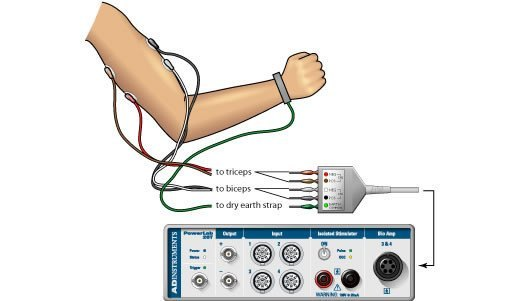
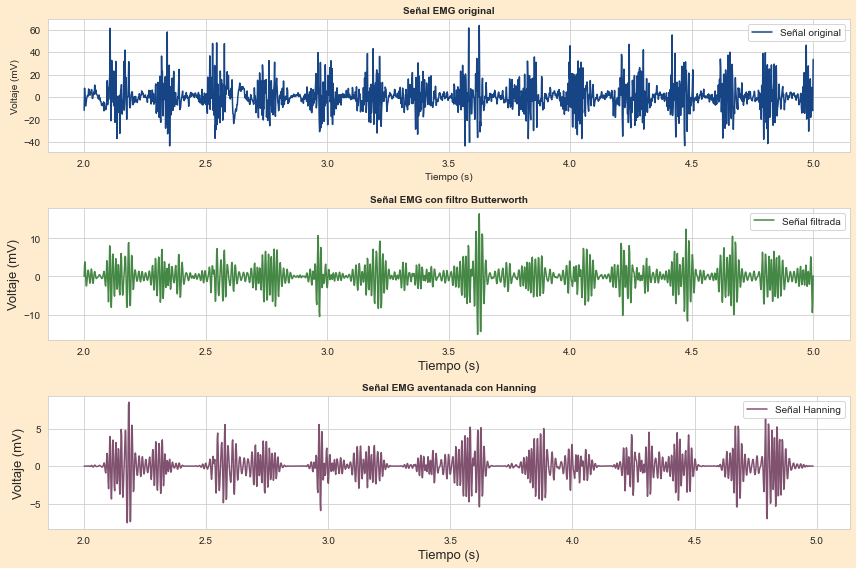

-*
<h1 align="center">ANÁLISIS DE SEÑAL EMG</h1>

<br />

En el área de la ingeniería biomédica, es fundamental conocer a fondo los distintos aspectos del cuerpo humano y sus funciones. Para ello, resulta indispensable contar con tecnologías que permitan analizar los fenómenos fisiológicos. Una de estas tecnologías es la electromiografía (EMG), un examen que mide la actividad eléctrica de los músculos. En este caso, al realizarla, los electrodos superficiales colocados sobre el brazo del paciente captan esta actividad eléctrica y la convierten en una señal digital. Esta señal contiene información valiosa que puede ser utilizada para detectar anomalías o disfunciones musculares. 

<br />

Este algoritmo es capaz de procesar la señal EMG, eliminando el ruido y realizando un análisis espectral detallado. De esta manera, es posible obtener información precisa sobre la frecuencia y amplitud de las contracciones musculares, lo cual es fundamental para diversas aplicaciones médicas y de investigación.

<br />

<div align="center">
 
</div>


## Tabla de contenidos:
---

- [OBJETIVO](#objetivo)
- [MONTAJE](#montaje)
- [PROCESAMIENTO DE LAS SEÑALES](#procesamiento)
- [ANÁLISIS DE RESULTADOS](#resultados)
- [APLICACIONES EN BIOMÉDICA](#aplicaciones)


## Objetivo
---
En este trabajo, se implementaron filtros digitales (Butterworth), la transformada rápida de Fourier y la técnica de ventana de Hamming para analizar señales EMG. El objetivo fue evaluar la fatiga muscular durante el levantamiento repetitivo de pesas.

## Montaje
---
Se empleó una placa STM32F103C8T8 como plataforma de adquisición de datos. Un sensor AD8232, conectado a la placa, se encargó de captar la actividad eléctrica del músculo y convertirla en una señal digital a través de una conversión analógica-digital. Electrodos superficiales se adhirieron al brazo del sujeto para registrar la señal EMG durante la realización de contracciones isométricas apretando y soltando una pelota anti-estrés. Los datos obtenidos fueron almacenados en formato .txt y posteriormente procesados.

<div align="center">
 
</div>


## Procesamiento
---
### Paso 1: Leer la señal .txt

<br />

Se cargan los datos del archivo .txt y se separan en dos arreglos: voltaje y tiempo. Estos arreglos servirán como entrada para el análisis posterior.
```

datos = np.loadtxt('karen_y_pau.txt', delimiter=',')
tiempo = datos[:, 0]  
voltaje = datos[:, 1]  

```
### Paso 2: Definir frecuencia de muestreo (fs)
<br />

Se establece una frecuencia de muestreo de 2000 Hz para garantizar la captura adecuada de las características de la señal. Este valor se selecciona considerando el teorema de Nyquist y permite un margen de seguridad para el diseño de los filtros, los cuales operarán a la mitad de esta frecuencia.
```
fs = 2000
```

### Paso 3: Filtrado (Funciones Butterworth)
<br />

Se definen tres funciones con las que se diseñará el filtro final por el que se pasará la señal para ser procesada. De los filtros Butterworth es posible obtener los coeficientes correspondientes, los cuales ayudan a definir factores como la ganancia, la estabilidad y la respuesta. Se obtienen cuatro coeficientes, dos para cada filtro (pasa-bajas y pasa-altas). Luego, se construyen en su totalidad los filtros finales, definiendo la frecuencia de corte para el pasa-altas (200 Hz) y la frecuencia de corte para el pasa-bajas (300 Hz). Asimismo, ambos filtros son de orden 4, lo cual garantiza una atenuación adecuada de las frecuencias no deseadas.

```
def pasabaja(cutoff, fs, order=5):
    nyquist = 0.5 * fs 
    normal_cutoff = cutoff / nyquist
    b, a = butter(order, normal_cutoff, btype='low', analog=False)
    return b, a

def pasaalta(cutoff, fs, order=5):
    nyquist = 0.5 * fs 
    normal_cutoff = cutoff / nyquist
    b, a = butter(order, normal_cutoff, btype='high', analog=False)
    return b, a

def filtros(data, fs):
   
    fc_alta = 200 
    fc_baja = 300  
    
    b_high, a_high = pasaalta(fc_alta, fs, order=4)
    b_low, a_low = pasabaja(fc_baja, fs, order=4)
    
    # Pasa alta
    
    filtrada = filtfilt(b_high, a_high, data)
    
    # Pasa baja
    
    filtrada = filtfilt(b_low, a_low, filtrada)
    
    return filtrada

```


### Paso 4: Análisis por FFT

En esta primera parte, se utiliza la técnica de ventana de Hamming, la cual consiste en una técnica que permite tomar segmentos de la señal y multiplicarlos por la "Ventana de Hanning", la cual, es una función matemática que permite segmentar y suavizar la señal, esto es útil para realizar luego la FFT. 

```
def hanning(data, window_size, fs):
    
    n = len(data)
    ventana = np.hanning(window_size)
    datos_aventanados = []

    
    for i in range(0, n - window_size, window_size):
        
        segmento = data[i:i+window_size]
        segmento_aventanado = segmento * ventana
        datos_aventanados.append(segmento_aventanado)

    
    datos_aventanados = np.concatenate(datos_aventanados)
    
    return datos_aventanados
```
Luego de haber suavizado la señal, es necesario separar y elegir los segmentos de la señal que son distintos de cero, ya que estos son los que se van a analizar. Esto se debe a que, por lo general, los segmentos nulos corresponden a información no deseada (ruido o partes no relevantes de la señal). De esta manera, el análisis FFT es más detallado y confiable. Al final de esta función, se devuelven solo los segmentos no nulos.

<br />

```
def distinto_de_cero(data_aventanada):
    segmentos = []
    segmento_actual = []
    
    for i in range(len(data_aventanada)):
        if data_aventanada[i] != 0:
            segmento_actual.append(data_aventanada[i])
        else:
            if len(segmento_actual) > 0:
                segmentos.append(np.array(segmento_actual))
                segmento_actual = []
    
    if len(segmento_actual) > 0:
        segmentos.append(np.array(segmento_actual))
    
    return segmentos

```
<br />

Finalmente, se aplica la Transformada Rápida de Fourier (FFT), la cual permite visualizar la distribución de las frecuencias en cada segmento de la señal (un total de 7). Al aplicar la función FFT, se obtienen las transformadas discretas de Fourier en numerosas divisiones, lo que posibilita transformar cada segmento del dominio del tiempo al dominio de la frecuencia. Es fundamental calcular el módulo (magnitud) de los resultados, dado que esta operación puede generar números complejos.

```

def fft_segmentos(segmentos, fs):
    for i, segmento in enumerate(segmentos):
        espectro = np.abs(fft(segmento))
        frecuencias = np.fft.fftfreq(len(segmento), d=1/fs)
        plt.figure(figsize=(10, 6), facecolor='blanchedalmond') 
        plt.plot(frecuencias[:len(segmento) // 2], espectro[:len(segmento) // 2], 
         label=f'FFT del Segmento {i+1}', 
         color='goldenrod', linewidth=2, linestyle='-')  
        plt.title('Espectro de Frecuencias', fontsize=16, fontweight='bold')
        plt.xlabel('Frecuencia (Hz)', fontsize=16)
        plt.ylabel('Magnitud', fontsize=16)
        plt.grid(color='gray', linestyle=':', linewidth=0.5)  
        plt.legend(loc='upper right', fontsize=12, frameon=False)
        plt.tight_layout()
        plt.show()

```

### Paso 5: Gráficar cada segmento y cálcular su media

Finalmente, una vez dividida la señal en segmentos, se calcula la media de cada uno. Esto con el objetivo de analizar el comportamiento de la señal a medida que el músculo se fatiga. Además, se genera una gráfica para cada segmento obtenido.

```
fft_segmentos(segmentos, fs)

def calcular_media_segmentos(segmentos):
    for i, segmento in enumerate(segmentos):
        media = np.mean(segmento)
        print(f'Media del Segmento {i+1}: {media}')

def graficar_segmentos(segmentos, fs):
    plt.figure(figsize=(12, 8), facecolor='blanchedalmond')
    
    for i, segmento in enumerate(segmentos):
        plt.subplot(len(segmentos), 1, i + 1)
        t_segmento = np.arange(0, len(segmento)) / fs  # Crear eje de tiempo para cada segmento
        plt.plot(t_segmento, segmento, label=f'Segmento {i+1}', color='orange')
        plt.xlabel('Tiempo (s)')
        plt.ylabel('Voltaje (mV)')
        plt.title(f'Segmento {i+1} de la señal aventanada')
        plt.grid(True)
        plt.legend()
    
    plt.tight_layout()
    plt.show()
```


 	
## Resultados
---

> Filtrado de la señal

La figura muestra la señal original, caracterizada por ruido y picos indeseados, y una amplitud máxima considerable. En la parte central se observa la señal filtrada, donde se aprecia una disminución notable del ruido, evidenciada por la ausencia de cambios abruptos entre los picos y una reducción en la amplitud máxima. Este procesamiento permite centrarnos en las frecuencias medias, esenciales para un análisis detallado de la actividad muscular. Finalmente, la tercera gráfica corresponde a la señal con ventana, que exhibe una amplitud aún menor debido al efecto suavizante de las ventanas. Este paso adicional enfatiza la actividad muscular relevante y prepara la señal para su posterior análisis mediante la Transformada Rápida de Fourier (FFT).

<div align="center">
 
</div>

> Análisis temporal y espectral

El análisis temporal de la señal indica la variación de la misma a lo largo del tiempo, entonces, permite identificar la presencia de ruido y la observación del patrón que siguen las voces, esto teniendo en cuenta que en todas las grabaciones, las personas están diciendo las mismas cosas. Por otro lado, en el análisis espectral se pueden identificar las frecuencias predominantes de la señal.

### Aplicaciones

La biomedicina ha experimentado una revolución gracias al avance de las tecnologías de procesamiento de señales. Al aplicar técnicas sofisticadas de filtrado y análisis a los datos biológicos, los investigadores y médicos pueden obtener una visión más profunda de las enfermedades y desarrollar tratamientos más efectivos. Desde la detección temprana del cáncer hasta la mejora de la calidad de vida de pacientes con enfermedades crónicas, estas herramientas están transformando la forma en que entendemos y tratamos las enfermedades.
