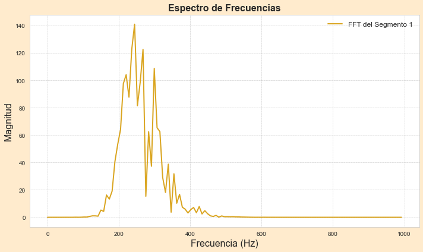
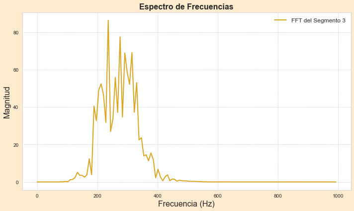
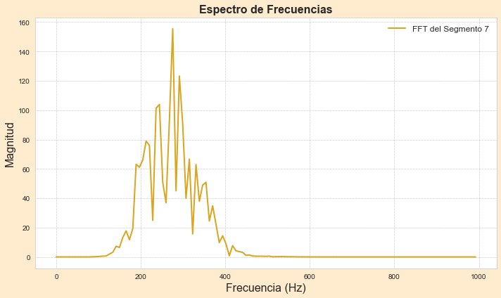
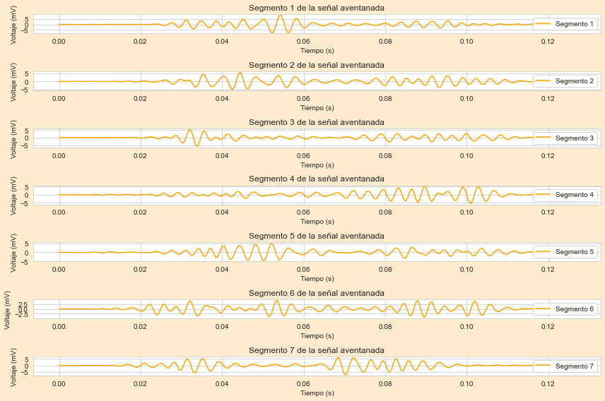

-*
<h1 align="center">ANÁLISIS DE SEÑAL EMG</h1>

<br />

En el área de la ingeniería biomédica, es fundamental conocer a fondo los distintos aspectos del cuerpo humano y sus funciones. Para ello, resulta indispensable contar con tecnologías que permitan analizar los fenómenos fisiológicos. Una de estas tecnologías es la electromiografía (EMG), un examen que mide la actividad eléctrica de los músculos. En este caso, al realizarla, los electrodos superficiales colocados sobre el brazo del paciente captan esta actividad eléctrica y la convierten en una señal digital. Esta señal contiene información valiosa que puede ser utilizada para detectar anomalías o disfunciones musculares. 

<br />

Este algoritmo es capaz de procesar la señal EMG, eliminando el ruido y realizando un análisis espectral detallado. De esta manera, es posible obtener información precisa sobre la frecuencia y amplitud de las contracciones musculares, lo cual es fundamental para diversas aplicaciones médicas y de investigación.

<br />

<div align="center">
 
</div>


## Tabla de contenidos:
---

- [OBJETIVO](#objetivo)
- [MONTAJE](#montaje)
- [PROCESAMIENTO DE LAS SEÑALES](#procesamiento)
- [ANÁLISIS DE RESULTADOS](#resultados)
- [APLICACIONES EN BIOMÉDICA](#aplicaciones)


## Objetivo
---
En este trabajo, se implementaron filtros digitales (Butterworth), la transformada rápida de Fourier y la técnica de ventana de Hamming para analizar señales EMG. El objetivo fue evaluar la fatiga muscular durante el levantamiento repetitivo de pesas.

## Montaje
---
Se empleó una placa STM32F103C8T8 como plataforma de adquisición de datos para registrar la actividad eléctrica del músculo profundo flexor de los dedos. Un sensor AD8232, conectado a la placa, se encargó de captar la señal EMG y convertirla en una señal digital a través de una conversión analógica-digital. Electrodos superficiales se adhirieron al brazo del sujeto para registrar la señal EMG durante la realización de contracciones isométricas apretando y soltando una pelota anti-estrés. Los datos obtenidos fueron almacenados en formato .txt y posteriormente procesados

<div align="center">
 
</div>


## Procesamiento
---
### Paso 1: Leer la señal .txt

<br />

Se cargan los datos del archivo .txt y se separan en dos arreglos: voltaje y tiempo. Estos arreglos servirán como entrada para el análisis posterior.
```

datos = np.loadtxt('karen_y_pau.txt', delimiter=',')
tiempo = datos[:, 0]  
voltaje = datos[:, 1]  

```
### Paso 2: Definir frecuencia de muestreo (fs)
<br />

Se establece una frecuencia de muestreo de 2000 Hz para garantizar la captura adecuada de las características de la señal. Este valor se selecciona considerando el teorema de Nyquist y permite un margen de seguridad para el diseño de los filtros, los cuales operarán a la mitad de esta frecuencia.
```
fs = 2000
```

### Paso 3: Filtrado (Funciones Butterworth)
<br />

Se definen tres funciones con las que se diseñará el filtro final por el que se pasará la señal para ser procesada. De los filtros Butterworth es posible obtener los coeficientes correspondientes, los cuales ayudan a definir factores como la ganancia, la estabilidad y la respuesta. Se obtienen cuatro coeficientes, dos para cada filtro (pasa-bajas y pasa-altas). Luego, se construyen en su totalidad los filtros finales, definiendo la frecuencia de corte para el pasa-altas (200 Hz) y la frecuencia de corte para el pasa-bajas (300 Hz). Asimismo, ambos filtros son de orden 4, lo cual garantiza una atenuación adecuada de las frecuencias no deseadas.

```
def pasabaja(cutoff, fs, order=5):
    nyquist = 0.5 * fs 
    normal_cutoff = cutoff / nyquist
    b, a = butter(order, normal_cutoff, btype='low', analog=False)
    return b, a

def pasaalta(cutoff, fs, order=5):
    nyquist = 0.5 * fs 
    normal_cutoff = cutoff / nyquist
    b, a = butter(order, normal_cutoff, btype='high', analog=False)
    return b, a

def filtros(data, fs):
   
    fc_alta = 200 
    fc_baja = 300  
    
    b_high, a_high = pasaalta(fc_alta, fs, order=4)
    b_low, a_low = pasabaja(fc_baja, fs, order=4)
    
    # Pasa alta
    
    filtrada = filtfilt(b_high, a_high, data)
    
    # Pasa baja
    
    filtrada = filtfilt(b_low, a_low, filtrada)
    
    return filtrada

```


### Paso 4: Análisis por FFT

En esta primera parte, se utiliza la técnica de ventana de Hamming, la cual consiste en una técnica que permite tomar segmentos de la señal y multiplicarlos por la "Ventana de Hanning", la cual, es una función matemática que permite segmentar y suavizar la señal, esto es útil para realizar luego la FFT. 

```
def hanning(data, window_size, fs):
    
    n = len(data)
    ventana = np.hanning(window_size)
    datos_aventanados = []

    
    for i in range(0, n - window_size, window_size):
        
        segmento = data[i:i+window_size]
        segmento_aventanado = segmento * ventana
        datos_aventanados.append(segmento_aventanado)

    
    datos_aventanados = np.concatenate(datos_aventanados)
    
    return datos_aventanados
```
Luego de haber suavizado la señal, es necesario separar y elegir los segmentos de la señal que son distintos de cero, ya que estos son los que se van a analizar. Esto se debe a que, por lo general, los segmentos nulos corresponden a información no deseada (ruido o partes no relevantes de la señal). De esta manera, el análisis FFT es más detallado y confiable. Al final de esta función, se devuelven solo los segmentos no nulos.

<br />

```
def distinto_de_cero(data_aventanada):
    segmentos = []
    segmento_actual = []
    
    for i in range(len(data_aventanada)):
        if data_aventanada[i] != 0:
            segmento_actual.append(data_aventanada[i])
        else:
            if len(segmento_actual) > 0:
                segmentos.append(np.array(segmento_actual))
                segmento_actual = []
    
    if len(segmento_actual) > 0:
        segmentos.append(np.array(segmento_actual))
    
    return segmentos

```
<br />

Finalmente, se aplica la Transformada Rápida de Fourier (FFT), la cual permite visualizar la distribución de las frecuencias en cada segmento de la señal (un total de 7). Al aplicar la función FFT, se obtienen las transformadas discretas de Fourier en numerosas divisiones, lo que posibilita transformar cada segmento del dominio del tiempo al dominio de la frecuencia. Es fundamental calcular el módulo (magnitud) de los resultados, dado que esta operación puede generar números complejos.

```

def fft_segmentos(segmentos, fs):
    for i, segmento in enumerate(segmentos):
        espectro = np.abs(fft(segmento))
        frecuencias = np.fft.fftfreq(len(segmento), d=1/fs)
        plt.figure(figsize=(10, 6), facecolor='blanchedalmond') 
        plt.plot(frecuencias[:len(segmento) // 2], espectro[:len(segmento) // 2], 
         label=f'FFT del Segmento {i+1}', 
         color='goldenrod', linewidth=2, linestyle='-')  
        plt.title('Espectro de Frecuencias', fontsize=16, fontweight='bold')
        plt.xlabel('Frecuencia (Hz)', fontsize=16)
        plt.ylabel('Magnitud', fontsize=16)
        plt.grid(color='gray', linestyle=':', linewidth=0.5)  
        plt.legend(loc='upper right', fontsize=12, frameon=False)
        plt.tight_layout()
        plt.show()

```

### Paso 5: Gráficar cada segmento y cálcular sus medidas estadísticas

Finalmente, una vez dividida la señal en segmentos, se calcula la media, mediana y desviación de cada uno. Esto con el objetivo de analizar el comportamiento de la señal a medida que el músculo se fatiga. Además, se genera una gráfica para cada segmento obtenido.

```
fft_segmentos(segmentos, fs)

def calcular_media_segmentos(segmentos):
    for i, segmento in enumerate(segmentos):
        media = np.mean(segmento)
        mediana = np.median(segmento)
        desviacion_std = np.std(segmento)
        print(f'Segmento {i+1}:')
        print(f'   Media: {media}')
        print(f'   Mediana: {mediana}')
        print(f'   Desviación estándar: {desviacion_std}\n')

def graficar_segmentos(segmentos, fs):
    plt.figure(figsize=(12, 8), facecolor='blanchedalmond')
    
    for i, segmento in enumerate(segmentos):
        plt.subplot(len(segmentos), 1, i + 1)
        t_segmento = np.arange(0, len(segmento)) / fs  # Crear eje de tiempo para cada segmento
        plt.plot(t_segmento, segmento, label=f'Segmento {i+1}', color='orange')
        plt.xlabel('Tiempo (s)')
        plt.ylabel('Voltaje (mV)')
        plt.title(f'Segmento {i+1} de la señal aventanada')
        plt.grid(True)
        plt.legend()
    
    plt.tight_layout()
    plt.show()
```


 	
## Resultados

> Filtrado de la señal

La figura muestra la señal original, caracterizada por ruido y picos indeseados, y una amplitud máxima considerable. En la parte central se observa la señal filtrada, donde se aprecia una disminución notable del ruido, evidenciada por la ausencia de cambios abruptos entre los picos y una reducción en la amplitud máxima. Este procesamiento permite centrarnos en las frecuencias medias, esenciales para un análisis detallado de la actividad muscular. Finalmente, la tercera gráfica corresponde a la señal con ventana, que exhibe una amplitud aún menor debido al efecto suavizante de las ventanas. Este paso adicional enfatiza la actividad muscular relevante y prepara la señal para su posterior análisis mediante la Transformada Rápida de Fourier (FFT). 

El ruido presente podría deberse a que el sensor AD8232 no está diseñado específicamente para señales EMG, sino para ECG. Por lo tanto, su configuración interna podría permitir el paso de frecuencias no deseadas. Además, el hecho de que los electrodos fueran superficiales y que el sujeto se moviera durante la adquisición de datos contribuyó significativamente a la presencia de ruido.

<div align="center">
 
</div>

> Espectro de frecuencias 

Al obtener un una grafica de espectro de frecuencias por cada segmento, se eligieron tres segmentos para analizar, y poder llegar a una conclusión, los segmentos elegidos fueron el primero, el de la mitad (tercero), y el último (séptimo). Las gráficas se observan a continuación: 

<div align="center">
 
</div>

<br />

<div align="center">
 
</div>

<br />

<div align="center">
 
</div>

<br/>

En las tres gráficas se observa una frecuencia dominante cercana a los 200 Hz, lo cual es coherente con los valores típicos reportados en la literatura para señales EMG. A pesar de que esta frecuencia dominante se mantiene relativamente constante a lo largo del tiempo, se aprecia una ligera disminución en la magnitud de las frecuencias superiores a los 200 Hz. Aunque este cambio es sutil, podría indicar los inicios de la fatiga muscular. Sin embargo, dado que el sujeto no experimentó una fatiga extrema y repitió el ejercicio de contracción y relajación varias veces, la disminución en la amplitud de las altas frecuencias no es muy pronunciada.

> Segmentos aventanados

Finalmente, la siguiente figura presenta una representación gráfica de cada segmento de la señal, una vez aplicado el ventaneo. En este gráfico, se establece una relación entre el voltaje, que es una medida de la energía eléctrica muscular, y el tiempo. Esto permite visualizar la evolución de la energía de las contracciones a lo largo del tiempo.
<br />

<div align="center">
 
</div>

<br/>

> Estadística de los segmentos

Tras realizar el cálculo de la media, mediana y desviación estándar de los segmentos, se puede extraer información en cuanto a la fátiga muscular, se obtiene lo siguiente: 

```

Segmento 1:
   Media: -1.5958475663812007e-05
   Mediana: -0.0002549212410906873
   Desviación estándar: 2.037227547033844

Segmento 2:
   Media: 3.2903944289091065e-06
   Mediana: 0.0002688583025762743
   Desviación estándar: 1.5663854234769161

Segmento 3:
   Media: -1.8065319725535814e-07
   Mediana: -8.851329330770554e-05
   Desviación estándar: 1.2962847319673492

Segmento 4:
   Media: 3.7231086002032916e-06
   Mediana: 0.0003305231014526877
   Desviación estándar: 1.5915748538961916

Segmento 5:
   Media: 2.2974969377265e-06
   Mediana: -0.0012085095304702974
   Desviación estándar: 1.4429970787094695

Segmento 6:
   Media: 3.941949630928005e-06
   Mediana: -8.516419982677684e-05
   Desviación estándar: 1.5360089074713423

Segmento 7:
   Media: 3.0792984529691326e-07
   Mediana: -0.00014122902193911457
   Desviación estándar: 1.9963664216191837

```
Al comparar la media del segmento tres con su espectro de frecuencia, se observa una concordancia significativa, lo que sugiere una disminución en la actividad muscular, posiblemente debido a la fatiga. Sin embargo, este patrón se revierte en el segmento cuatro, donde se aprecia un incremento en la media, indicando una recuperación parcial de la fuerza de contracción. Esta variabilidad podría explicarse por una disminución momentánea en la fuerza ejercida por el sujeto durante la adquisición de los datos del segmento tres.

Asimismo, al analizar la mediana, también se observa una disminución en el segmento tres. Esto sugiere que el sujeto pudo haber realizado una fuerza menor al apretar la pelota en este período. Por último, el aumento de la desviación estándar indica una mayor dispersión de los datos, lo que podría deberse a una mayor activación de unidades motoras. Esta pérdida de control estable es un indicio de un posible inicio de fatiga.

Tal como se indicó anteriormente, el sujeto no experimentó fatiga muscular significativa durante el período de análisis. La baja resistencia de la pelota anti estrés no generó una carga de trabajo suficiente para inducir fatiga muscular en el brazo. No obstante, la disminución observada en la media del segmento siete podría indicar una disminución leve en la capacidad de contracción muscular, sugiriendo un posible inicio de fatiga.

```

> Prueba de hipótesis

Para comprobar si existían diferencias significativas entre las medias de los distintos segmentos de la señal, se realizó un análisis de varianza (ANOVA). Este análisis nos permitió determinar si las variaciones observadas eran producto del azar o si, por el contrario, había diferencias reales entre los grupos. Si el valor p obtenido en el ANOVA resultó ser menor a 0.05, se concluyó que al menos una de las medias era diferente, rechazando así la hipótesis de que todas las medias eran iguales. El código aplicado es el siguiente: 

```
resultados_anova = f_oneway(*segmentos)


print(f'Estadístico F: {resultados_anova.statistic}')
print(f'Valor p: {resultados_anova.pvalue}')

alpha = 0.05
if resultados_anova.pvalue < alpha:
    print("Se rechaza la hipótesis nula: hay diferencias significativas entre las medias de los segmentos.")
else:
    print("No se rechaza la hipótesis nula: no hay diferencias significativas entre las medias de los segmentos.")

```
Luego, al correr el programa se observa el siguiente resultado: 

```
No se rechaza la hipótesis nula: no hay diferencias significativas entre las medias de los segmentos.

```


### Aplicaciones

El análisis de las señales que brinda el cuerpo humano es un campo fundamental en la ingeniería biomédica. Mediante este análisis, es posible detectar diversas anomalías, enfermedades o trastornos, lo que constituye un gran apoyo para la medicina. Un ejemplo claro de su aplicación es la evaluación de la rehabilitación, donde se puede monitorear el progreso de pacientes que se recuperan de lesiones musculares u otras afecciones. De igual manera, en el ámbito deportivo, este tipo de análisis permite medir la evolución de los atletas después de diferentes entrenamientos.
